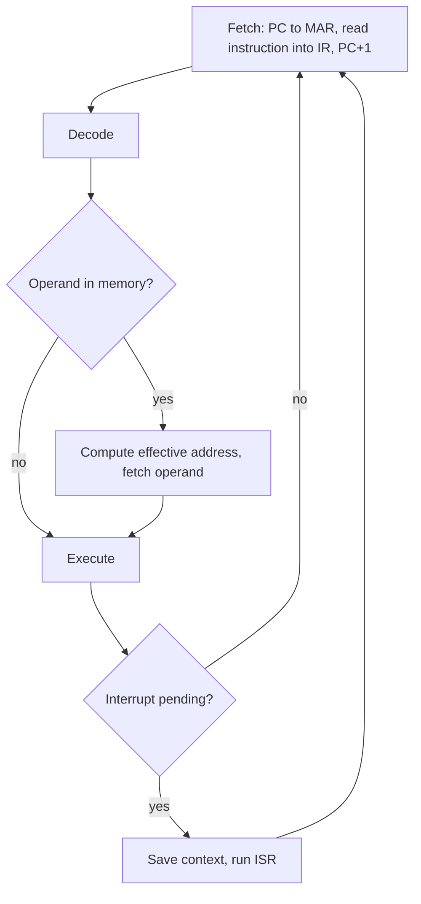
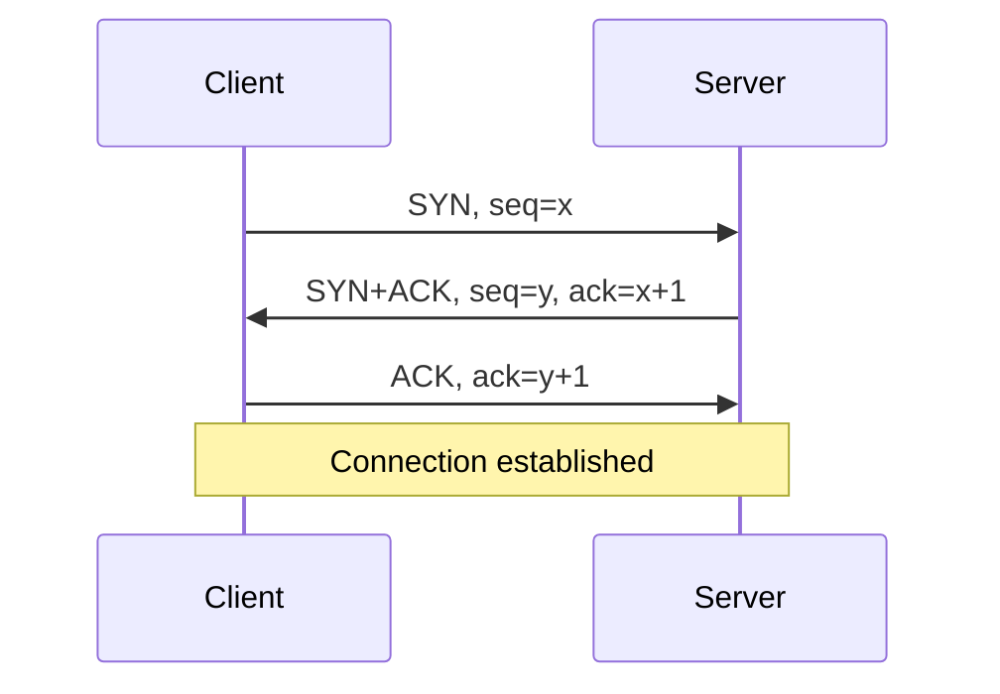
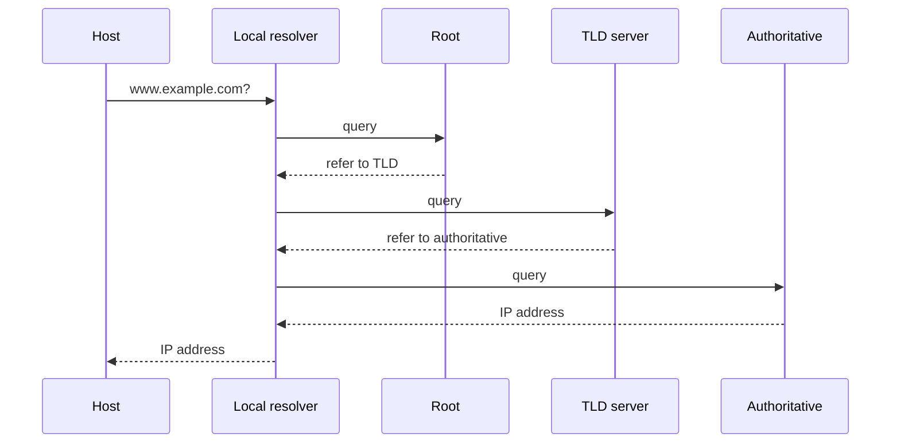

# Computer Networks and COA

Same format as the OS + DBMS page: topics, diagrams, questions. Blue = B.Tech semester/placement emphasis. Orange = GATE emphasis. GATE scope follows the official GATE 2027 CS syllabus (IIT Madras); B.Tech scope follows the usual university unit pattern, so check your own syllabus for exact order.

[COA topics](#co)[COA diagrams](#cod)[COA questions](#coq)[CN topics](#cn)[CN diagrams](#cnd)[CN questions](#cnq)

## Computer Organization and Architecture: topic map

**GATE 2027 official COA list:** instruction set and addressing modes; ALU design; control unit (hardwired and microprogrammed); memory interfacing and hierarchy (performance, cache memory mapping); I/O interface (interrupt and DMA); instruction pipelining and pipeline hazards. Some prep sites say the COA/CN lists were revised for 2027 and compare them with 2026. Use the official PDF as the reference. Number representation and floating point sit under Digital Logic in GATE, but B.Tech COA courses usually include them.

| Topic | B.Tech lens | GATE lens |
| --- | --- | --- |
| 1. Basic organization | Von Neumann vs Harvard, registers, bus structure, instruction cycle, RISC vs CISC | Light; mostly CPI and MIPS-type arithmetic |
| 2. Instruction set, addressing modes | Instruction formats (0/1/2/3-address), immediate, direct, indirect, register, indexed, base, relative, auto-inc/dec | Effective address, instruction-format bit counting, memory accesses per mode, expanding-opcode design. Frequent |
| 3. ALU and arithmetic | Adders, Booth multiplication, division, IEEE 754 floating point | Mostly asked under Digital Logic: overflow, Booth steps, float encoding |
| 4. Control unit | Hardwired vs microprogrammed, micro-instruction formats, control store, horizontal vs vertical | Control word size, number of control-store bits, which signals are active per step |
| 5. Memory hierarchy | RAM/ROM types, locality, cache, mapping (direct, associative, set-associative), replacement, write policies, virtual memory overview | Tag/index/offset bits, number of lines/sets, AMAT, hit ratio, multi-level cache, chip counting for memory interfacing. Very frequent |
| 6. I/O organization | Programmed I/O, interrupt-driven, DMA, bus arbitration, I/O processors | Interrupt vs polling overhead, DMA cycle stealing vs burst, CPU time lost during transfer |
| 7. Pipelining | Stages, speedup, structural, data and control hazards, forwarding, branch prediction | Cycle count, speedup, stalls with/without forwarding, CPI with branch penalty. Very frequent |
| 8. Parallelism (B.Tech) | Flynn's taxonomy, multiprocessors, cache coherence basics | Not in the 2027 list |

## COA: diagrams to know

**Instruction cycle**

**5-stage pipeline, no stalls (IF ID EX MEM WB)**

|  | 1 | 2 | 3 | 4 | 5 | 6 | 7 |
| --- | --- | --- | --- | --- | --- | --- | --- |
| I1 | IF | ID | EX | MEM | WB |  |  |
| I2 |  | IF | ID | EX | MEM | WB |  |
| I3 |  |  | IF | ID | EX | MEM | WB |

### Draw these by hand (exam favourites)

- Address split for direct, fully associative and set-associative cache: tag | index | offset
- Pipeline timing tables with stall bubbles and forwarding paths
- Hardwired control unit block diagram vs microprogrammed (control memory, microinstruction register, sequencer)
- DMA controller connected to CPU, memory and device; the interrupt-acknowledge sequence
- Memory hierarchy pyramid; chip-selection decoder for memory interfacing
- Instruction formats: opcode / mode / register / address fields

## COA: questions

### GATE-style numericals (tap to see answers)

1\. 32-bit address, 16 KB direct-mapped cache, 32 B blocks. Tag, index, offset bits?

Offset 5 bits (32 B). Lines = 16 KB / 32 B = 512, so index 9 bits. Tag = 32 − 9 − 5 = 18 bits.

2\. 32-bit address, 64 KB 4-way set-associative cache, 64 B blocks. Tag, index, offset bits?

Offset 6. Lines = 1024, sets = 1024 / 4 = 256, so index 8. Tag = 32 − 8 − 6 = 18 bits.

3\. Cache hit time 1 ns, miss rate 5%, miss penalty 100 ns. Average memory access time?

1 + 0.05 × 100 = 6 ns.

4\. 5-stage pipeline, 100 instructions, no hazards, one cycle per stage. Cycles and speedup over non-pipelined?

Pipelined: 5 + 99 = 104 cycles. Non-pipelined: 500 cycles. Speedup = 500 / 104 ≈ 4.81.

5\. Base CPI is 1; 20% of instructions are branches, each causing a 2-cycle penalty. Effective CPI?

1 + 0.2 × 2 = 1.4.

6\. Consecutive instructions with a RAW dependency, 5-stage pipeline, no forwarding, register file written in the first half and read in the second half of a cycle. Stall cycles?

2 stalls (the consumer's ID must wait until the producer's WB cycle).

7\. How many 1K × 8 chips make an 8K × 16 memory?

(8K/1K) × (16/8) = 8 × 2 = 16 chips.

8\. 32-bit instruction, 6-bit opcode, two operands from 32 registers each. Bits left for an immediate field?

32 − 6 − 5 − 5 = 16 bits.

9\. Memory accesses to fetch and complete an `ADD` whose operand uses indirect addressing (ignore the result write)?

3: one to fetch the instruction, one to read the pointer, one to read the operand.

### B.Tech theory (2, 5 and 10 mark style)

- Explain the instruction cycle with a diagram; differentiate Von Neumann and Harvard architecture.
- List and explain addressing modes with examples; compare RISC and CISC.
- Compare hardwired and microprogrammed control; explain horizontal vs vertical microinstructions.
- Explain direct, associative and set-associative mapping with a numerical example.
- Explain cache write policies (write-through, write-back) and replacement algorithms.
- Explain DMA modes (burst, cycle stealing, transparent) and the DMA transfer sequence.
- Compare programmed I/O, interrupt-driven I/O and DMA; explain vectored interrupts and priority.
- Explain instruction pipelining; describe structural, data and control hazards with remedies.
- Explain Booth's multiplication for a given pair of numbers; IEEE 754 single-precision format.
- Explain Flynn's classification and the cache-coherence problem.

## Computer Networks: topic map

**GATE 2027 official CN list:** principles of layering; basics of switching (circuit, packet, virtual circuit) and performance metrics; data link layer (error detection, medium access control, Ethernet); distance vector and link state routing; IPv4 (fragmentation, CIDR, NAT); TCP (flow control, congestion control, socket API); DNS and HTTP. Wireless, IPv6, SMTP/FTP and network security are not named there, so they are B.Tech-first. Check recent previous-year papers for how marks are actually distributed.

| Topic | B.Tech lens | GATE lens |
| --- | --- | --- |
| 1. Layering, OSI and TCP/IP | Functions of each layer, encapsulation, protocol vs service, topologies, network types | Which layer does what; headers added at each layer; mostly 1-mark |
| 2. Physical layer | Transmission media, multiplexing, Nyquist and Shannon capacity, modulation, guided/unguided media | Nyquist/Shannon capacity numericals, bandwidth-delay product |
| 3. Switching and performance | Circuit, packet (datagram, virtual circuit) switching, delays | Transmission, propagation, queuing delay; store-and-forward end-to-end delay; throughput over multiple links |
| 4. Data link: errors and flow | Framing, parity, checksum, CRC, Hamming; Stop-and-Wait, Go-Back-N, Selective Repeat | CRC remainder, minimum Hamming distance, window size, link utilization, sequence-number bits. Very frequent |
| 5. MAC and Ethernet | ALOHA, CSMA, CSMA/CD, CSMA/CA, Ethernet frame, switches/bridges, VLAN, 802.11 overview | Min frame size from RTT, backoff, ALOHA efficiency, collision-domain reasoning |
| 6. Network layer and IPv4 | Addressing classes, subnetting, ICMP, ARP, DHCP, NAT, IPv6 basics | CIDR, network/broadcast address, host count, subnet design, fragmentation (offset, MF), NAT table. Very frequent |
| 7. Routing | RIP, OSPF, BGP, static vs dynamic, interior vs exterior | Distance vector updates and count-to-infinity, split horizon, Dijkstra for link state |
| 8. Transport layer | UDP vs TCP, connection setup/teardown, sockets, ports | 3-way handshake, sequence/ack numbers, slow start/congestion avoidance, cwnd and ssthresh evolution, throughput = window / RTT. Frequent |
| 9. Application layer | DNS, HTTP, SMTP, POP3/IMAP, FTP, web caching, CDN | DNS resolution steps, persistent vs non-persistent HTTP RTT counting |
| 10. Security (B.Tech) | Cryptography basics, firewalls, VPN, SSL/TLS overview | Not in the 2027 list |

## CN: diagrams to know

**TCP three-way handshake**

**DNS resolution (iterative)**

### Draw these by hand (exam favourites)

- OSI and TCP/IP stacks side by side, with protocol examples at each layer
- Sender/receiver timelines for Stop-and-Wait, Go-Back-N and Selective Repeat, with window sliding
- TCP congestion window vs time: slow start, congestion avoidance, timeout reset, fast recovery
- IPv4 header and the fragmentation fields (identification, MF, offset); TCP segment header
- Ethernet frame format and a CSMA/CD collision timeline
- Distance vector tables over several rounds; Dijkstra spanning tree for link state
- Subnetting address bar: network | subnet | host bits

## CN: questions

### GATE-style numericals (tap to see answers)

1\. 1500-byte packet over 3 store-and-forward links of 1 Mbps each. End-to-end transmission delay (ignore propagation and queuing)?

12,000 bits / 1 Mbps = 12 ms per link; 3 × 12 = 36 ms.

2\. Stop-and-Wait: frame 1000 bits, 1 Mbps link, one-way propagation delay 20 ms. Link efficiency?

Tt = 1 ms, Tp = 20 ms. Efficiency = 1 / (1 + 2×20) = 1/41 ≈ 2.4%.

3\. Same link as above. Sender window for full utilization, and sequence bits needed for Go-Back-N?

Window = 1 + 2a = 41. Go-Back-N needs 41 + 1 = 42 sequence numbers, so ⌈log₂ 42⌉ = 6 bits.

4\. CRC with generator 1011 (x³+x+1) and data 1101. Remainder and transmitted word?

Divide 1101000 by 1011: remainder 001. Codeword = 1101001 (it divides evenly by 1011).

5\. Host 200.10.20.130/26. Network address, broadcast address, usable hosts?

Last octet 130 = 10000010; the /26 keeps 2 bits of it, so the block starts at 128. Network 200.10.20.128, broadcast 200.10.20.191, usable hosts 64 − 2 = 62.

6\. A 4000-byte IP datagram (20-byte header) crosses a link with MTU 1500. Fragments, sizes and offsets?

Payload 3980 B; each fragment carries up to 1480 B (a multiple of 8). Fragments: 1480, 1480, 1020 bytes of data. Offsets 0, 185, 370; MF = 1, 1, 0. Total 3 fragments.

7\. 10 Mbps CSMA/CD Ethernet, round-trip propagation time 51.2 µs. Minimum frame size?

10×10⁶ × 51.2×10⁻⁶ = 512 bits = 64 bytes.

8\. TCP Tahoe/Reno: ssthresh = 16 MSS, cwnd starts at 1. After how many RTTs does cwnd reach 16? A timeout occurs at cwnd = 24: new ssthresh and cwnd?

1, 2, 4, 8, 16: reaches 16 after 4 RTTs. On timeout: ssthresh = 24 / 2 = 12 MSS and cwnd = 1 MSS.

9\. Receiver window 64 KB, RTT 100 ms, no losses. Maximum TCP throughput?

65,536 B / 0.1 s = 655,360 B/s ≈ 5.24 Mbps.

10\. A page with 1 base HTML file and 10 objects, each fetch needs the TCP handshake. RTTs (ignore transmission time): non-persistent without parallelism vs persistent without pipelining?

Non-persistent: 11 objects × 2 RTT = 22 RTT. Persistent without pipelining: 2 RTT for the base page, then 1 RTT per object = 2 + 10 = 12 RTT.

### B.Tech theory (2, 5 and 10 mark style)

- Compare the OSI and TCP/IP models; explain the function of each layer.
- Explain circuit switching, packet switching and virtual circuits with a comparison.
- Explain CRC, checksum and Hamming code with worked examples.
- Explain Stop-and-Wait, Go-Back-N and Selective Repeat with diagrams.
- Explain ALOHA, CSMA/CD and CSMA/CA; describe the Ethernet frame.
- Explain IPv4 addressing, subnetting and CIDR with an example; compare IPv4 and IPv6.
- Explain distance vector routing and the count-to-infinity problem; explain link state routing.
- Compare TCP and UDP; explain the 3-way handshake and connection termination.
- Explain TCP flow control and congestion control (slow start, congestion avoidance, fast retransmit).
- Explain DNS, HTTP (persistent vs non-persistent), SMTP and FTP.

## How to use this

- **Semester exams:** write each theory answer once with its diagram, and redraw the hand-drawn list from memory.
- **GATE:** for COA, drill cache bit-splitting, AMAT and pipeline cycle counts. For CN, drill sliding window efficiency, CRC, CIDR/subnetting, fragmentation, and TCP congestion window. Then solve previous-year papers topic by topic.
- **Books:** *Computer Organization and Embedded Systems* (Hamacher) or Mano for COA; Kurose and Ross, plus Forouzan, for CN.