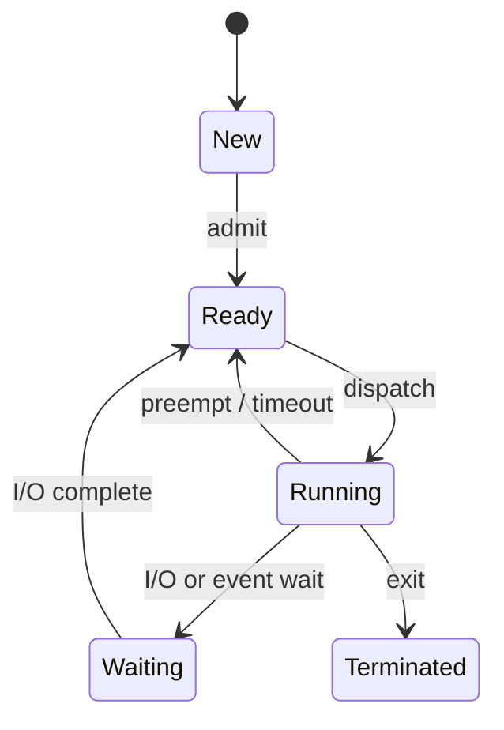
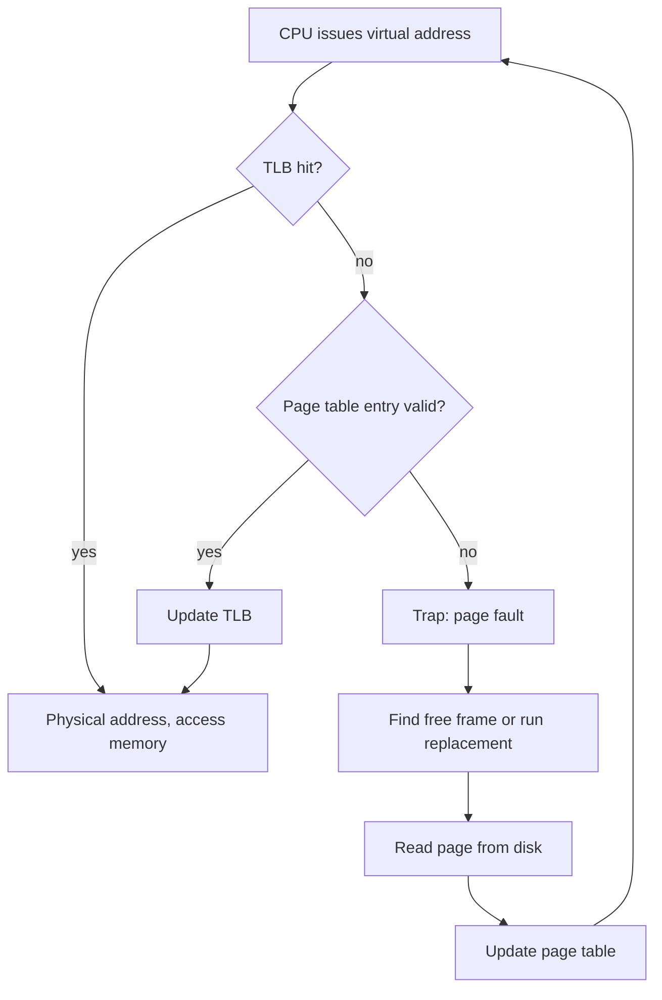
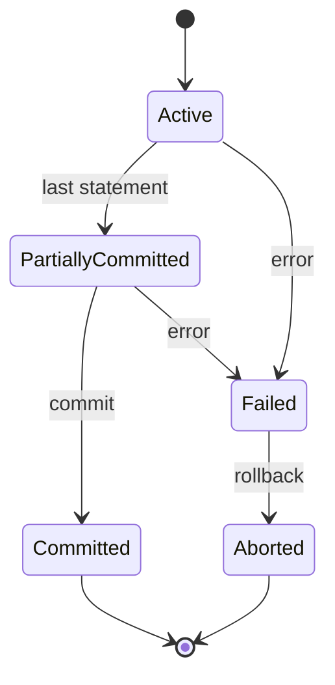
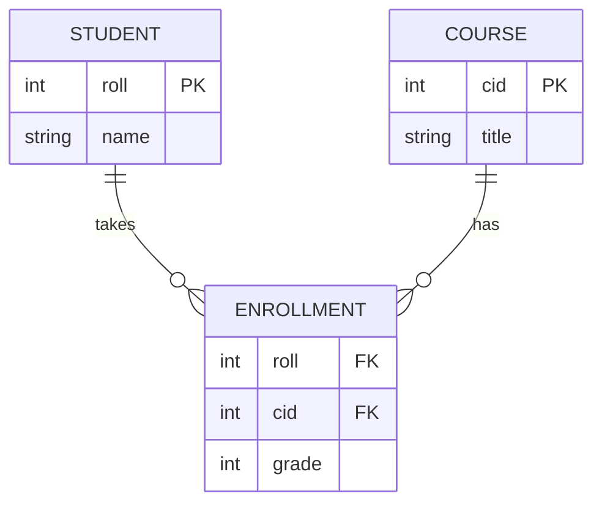

# Operating Systems and DBMS

One page for two subjects: topics, diagrams to master, and questions. Blue = B.Tech semester/placement emphasis. Orange = GATE emphasis. GATE scope follows the official GATE 2027 CS syllabus (IIT Madras); B.Tech scope follows the usual university unit pattern (AKTU-style), so check your own syllabus PDF for exact unit order.

[OS topics](#os)[OS diagrams](#osd)[OS questions](#osq)[DBMS topics](#db)[DBMS diagrams](#dbd)[DBMS questions](#dbq)

## Operating Systems: topic map

**GATE 2027 official OS list:** system calls, processes, threads, inter-process communication, concurrency and synchronization, deadlock, CPU and I/O scheduling, memory management and virtual memory, file systems. Third-party sites put OS at roughly 8–10 marks per paper (approximate, varies by year).

| Topic | B.Tech lens | GATE lens |
| --- | --- | --- |
| 1. Introduction, system calls | OS goals, types (batch, time-sharing, RTOS, distributed), kernel vs user mode, monolithic vs microkernel, system call categories, booting | Mode switch, trap/interrupt flow, which instructions are privileged. Mostly 1-mark conceptual |
| 2. Processes and threads | PCB, state diagram, schedulers (long/short/medium), context switch, user vs kernel threads, multithreading models | `fork()` counting puzzles, shared vs private thread resources, context-switch cost |
| 3. IPC | Pipes, shared memory, message passing, sockets, signals | Output of programs using fork + pipe/shared variables |
| 4. CPU scheduling | FCFS, SJF, SRTF, priority, Round Robin, MLQ, MLFQ; Gantt charts; criteria | Numericals: average waiting/turnaround, effect of quantum, convoy effect, starvation, preemptive vs not. Very frequent |
| 5. Synchronization | Race condition, critical-section requirements, Peterson, test-and-set, semaphores, monitors, classic problems (producer-consumer, readers-writers, dining philosophers) | Semaphore code tracing, find min/max values, correctness of proposed CS solutions, counting-semaphore arithmetic. Very frequent |
| 6. Deadlock | Four conditions, RAG, prevention, avoidance (Banker's), detection, recovery | Safe-state checks, `n(m-1)+1` style minimum-resource questions, cycle in RAG with multiple instances |
| 7. Memory management | Contiguous allocation (first/best/worst fit), fragmentation, paging, segmentation, segmented paging | Address translation bits, page table size, multilevel paging, TLB and EAT, inverted page table |
| 8. Virtual memory | Demand paging, page fault, replacement (FIFO, LRU, Optimal, Clock), thrashing, working set | Count page faults, Belady's anomaly, effective access time with page faults, frame allocation |
| 9. File systems | File concepts, directory structures, allocation (contiguous, linked, indexed), free-space management, FAT, Unix inode, mounting | Max file size with inode pointers, FAT size, block-size trade-offs, number of disk accesses |
| 10. I/O and disk | I/O hardware, polling, interrupts, DMA, disk structure, RAID, buffering and spooling | Disk scheduling total head movement (FCFS, SSTF, SCAN, C-SCAN, LOOK), seek+rotation+transfer time |

## OS: diagrams to know

**Process state diagram**

**Page fault handling**

### Draw these by hand (exam favourites)

- Gantt charts for each scheduling algorithm, with the ready queue written beside it
- Resource allocation graph with a cycle (single instance) vs a cycle without deadlock (multiple instances)
- Virtual-to-physical address split: page number | offset, with TLB and multilevel page tables
- Unix inode: 12 direct, single, double, triple indirect pointers
- Disk arm path for SCAN, C-SCAN, LOOK on a number line
- Producer-consumer layout with three semaphores (`mutex`, `empty`, `full`); dining philosophers table
- Memory hierarchy / layered OS structure vs microkernel structure; segmentation table lookup

## OS: questions

### GATE-style numericals (tap to see answers)

1\. How many processes exist after `fork(); fork(); fork();` runs in a single process?

8 in total (the original plus 7 children): each fork doubles the count, 2³.

2\. Round Robin, q = 2. P1 (arrival 0, burst 5), P2 (1, 3), P3 (2, 1). Average waiting time? (A process arriving at the same instant a quantum ends enters the queue before the preempted one.)

Order: P1 0–2, P2 2–4, P3 4–5, P1 5–7, P2 7–8, P1 8–9. Waiting times: P1 4, P2 4, P3 2. Average = 10/3 ≈ 3.33.

3\. A counting semaphore starts at 10. After 6 P (wait) and 4 V (signal) operations complete, what is its value?

10 − 6 + 4 = 8.

4\. 3 processes each need up to 4 instances of a resource. Minimum total instances that guarantee no deadlock?

n(m−1)+1 = 3×3+1 = 10.

5\. 32-bit virtual address, 4 KB pages, 4-byte page-table entry. Size of a single-level page table?

2²⁰ entries × 4 B = 4 MB (it spans 1024 pages, which is why multilevel paging exists).

6\. TLB hit ratio 90%, TLB lookup 10 ns, memory access 100 ns, single-level page table. Effective access time?

0.9 × (10+100) + 0.1 × (10+100+100) = 99 + 21 = 120 ns.

7\. Reference string 1 2 3 4 1 2 5 1 2 3 4 5 with FIFO: faults for 3 frames vs 4 frames?

9 faults with 3 frames, 10 with 4. This is Belady's anomaly.

8\. Head at 53; requests 98, 183, 37, 122, 14, 124, 65, 67. Total head movement under FCFS and SSTF?

FCFS = 640 cylinders. SSTF = 236 cylinders.

9\. Inode with 12 direct, 1 single, 1 double, 1 triple indirect pointer; block 1 KB; pointer 4 B. Maximum file size?

256 pointers per block. Blocks = 12 + 256 + 256² + 256³ = 16,843,020; size ≈ 16,843,020 KB ≈ 16.06 GB.

### B.Tech theory (2, 5 and 10 mark style)

- Differentiate process and thread; user-level and kernel-level threads.
- Explain the Process Control Block and the steps of a context switch.
- Compare FCFS, SJF, RR and priority scheduling with a worked example and Gantt chart.
- State the three requirements of a critical-section solution; explain Peterson's solution and why it works.
- Solve producer-consumer and readers-writers using semaphores.
- List the four necessary conditions for deadlock; explain Banker's algorithm with an example.
- Explain paging with a diagram; compare paging and segmentation; internal vs external fragmentation.
- What is thrashing? How does the working-set model prevent it?
- Compare contiguous, linked and indexed file allocation.
- Explain SCAN and C-SCAN; describe RAID levels 0, 1, 5.

## DBMS: topic map

**GATE 2027 official Databases list:** ER-model; relational model (relational algebra, tuple calculus, SQL); integrity constraints, normal forms; file organization, indexing (e.g. B and B+ trees); transactions and concurrency control. Reported weight is roughly 6–10 marks per paper (approximate). Some prep sites say the 2027 list was trimmed versus 2026; the official PDF above is the reference. Items like crash recovery (ARIES) are not named in it, so treat them as B.Tech-first.

| Topic | B.Tech lens | GATE lens |
| --- | --- | --- |
| 1. Introduction and architecture | File system vs DBMS, three-schema architecture, data independence, DBA, DDL/DML | Rare, mostly 1-mark conceptual |
| 2. ER and EER model | Entities, attributes, relationships, keys, weak entities, generalization/specialization, ER-to-table mapping | Minimum number of tables from an ER diagram, participation and cardinality constraints |
| 3. Relational model and algebra | Keys, integrity constraints, σ π ∪ − × ⋈ ÷, relational calculus, query writing | Candidate-key counting, result size bounds for joins, expressing queries in algebra/TRC, division |
| 4. SQL | DDL/DML, joins, aggregates, GROUP BY/HAVING, nested and correlated subqueries, views, triggers, PL/SQL basics | Output of tricky queries, NULL behaviour, `NOT IN` vs `NOT EXISTS`, equivalent queries. Frequent |
| 5. Dependencies and normalization | Functional dependencies, closure, 1NF–BCNF, 4NF/5NF overview, decomposition | Attribute closure, finding all candidate keys, highest normal form, lossless and dependency-preserving tests, canonical cover. Very frequent |
| 6. File organization and indexing | Heap/sorted files, primary/secondary/clustered index, B and B+ trees, hashing | Blocking factor, number of block accesses, B/B+ tree order, max/min keys, height, index size |
| 7. Transactions and concurrency | ACID, states, schedules, 2PL, timestamp ordering, deadlock handling, isolation levels, log-based recovery, checkpoints | Conflict/view serializability, recoverable/cascadeless/strict schedules, 2PL variants, timestamp protocol outcomes. Very frequent |

## DBMS: diagrams to know

**Transaction states**

**ER example (many-to-many with a junction)**

### Draw these by hand (exam favourites)

- ER notation: weak entity (double box), multivalued attribute (double oval), total participation (double line), ISA hierarchy
- B+ tree insertion with node splits (and deletion with borrow/merge); linked leaf level
- Precedence (serialization) graph from a schedule, with cycle check
- Three-schema architecture: external, conceptual, internal levels
- Extendible hashing: directory with global depth, buckets with local depth
- Lock-compatibility matrix (S/X) and the growing/shrinking phases of 2PL

## DBMS: questions

### GATE-style numericals (tap to see answers)

1\. R(A,B,C,D) with A→B, B→C, C→D. Candidate key and highest normal form?

Key: A. No partial dependency (single-attribute key), but A→B→C is transitive, so it is in 2NF, not 3NF.

2\. R(A,B,C,D) with AB→C, C→D, D→A. How many candidate keys?

B never appears on a right side, so every key contains B. AB, BC and BD each have closure ABCD. Answer: 3.

3\. R(A,B,C,D,E) has exactly one candidate key, AB. How many superkeys?

2^(5−2) = 8.

4\. R(A,B,C), F = {A→B}. Decompose into (A,B) and (A,C). Lossless? Dependency preserving?

Yes to both: the common attribute A determines B, and A→B sits inside (A,B).

5\. Block 512 B, key 10 B, block pointer 8 B, record pointer 8 B. Order of a B+ tree internal node and leaf node?

Internal: 8p + 10(p−1) ≤ 512 gives p = 29. Leaf: p(10+8) + 8 ≤ 512 gives p = 28.

6\. Schedule r1(x) r2(x) w1(x) w2(x). Conflict serializable?

No. r2(x) before w1(x) gives T2→T1; r1(x) before w2(x) gives T1→T2. The precedence graph has a cycle.

7\. Table R has values {1, NULL} in column a. What does `SELECT * FROM S WHERE x NOT IN (SELECT a FROM R)` return?

Empty. `x NOT IN (1, NULL)` evaluates to false or UNKNOWN for every x, so no row qualifies.

8\. R(A,B) has m tuples, S(B,C) has n tuples. B is the key of S and a foreign key in R. Tuples in R ⋈ S? And in general (no keys)?

Exactly m. In general: minimum 0, maximum m × n.

9\. What does strict 2PL guarantee, and what does it not?

Guarantees conflict serializability and strict (hence cascadeless) recoverability. Does not prevent deadlock.

### B.Tech theory (2, 5 and 10 mark style)

- Advantages of DBMS over a file system; explain the three-schema architecture and data independence.
- Draw an ER diagram for a university or hospital scenario and convert it to relational tables.
- Explain the types of keys with examples; differentiate primary, candidate, super and foreign key.
- Write relational algebra and SQL for a given schema, including a division query.
- Differences between inner, left, right and full outer joins; correlated vs non-correlated subquery.
- Explain 1NF, 2NF, 3NF and BCNF with an example decomposition; why does BCNF sometimes lose dependencies?
- Insert keys into a B+ tree of given order; compare B tree and B+ tree.
- Explain ACID with a bank-transfer example; describe the transaction state diagram.
- Explain two-phase locking, its variants, and how timestamp ordering works.
- Explain deadlock handling in a DBMS (wait-for graph) and log-based recovery with checkpoints.

## How to use this

- **Semester exams:** do the theory list, then draw each hand-drawn diagram once without looking.
- **GATE:** prioritise scheduling, synchronization, paging/TLB and disk numericals for OS; normalization, SQL, B+ tree sizing and serializability for DBMS. Then solve previous-year questions topic by topic.
- **Books:** Silberschatz (*Operating System Concepts*; *Database System Concepts*) is the standard reference for both lenses.